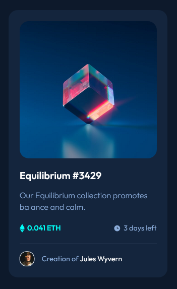

# Frontend Mentor - Skilled e-learning landing page solution

This is a solution to the [Skilled e-learning landing page challenge on Frontend Mentor](https://www.frontendmentor.io/challenges/skilled-elearning-landing-page-S1ObDrZ8q). Frontend Mentor challenges help you improve your coding skills by building realistic projects.

## Table of contents

- [Overview](#overview)
  - [The challenge](#the-challenge)
  - [Screenshot](#screenshot)
  - [Links](#links)
- [My process](#my-process)
  - [Built with](#built-with)
- [Author](#author)

## Overview

### The challenge

Users should be able to:

- View the optimal layout depending on their device's screen size
- See hover states for interactive elements

### Screenshot

### Links

- Solution URL: [https://www.frontendmentor.io/solutions/nft-preview-card-component-using-sass-_zMi6_guC2]
- Live Site URL: [https://fem-nft-preview-card-component-pi.vercel.app/]

## My process

### Built with

- Flexbox
- [vite] (https://vitejs.dev/guide/features.html) 
- [Sass] (https://sass-lang.com/)

## Author

- Frontend Mentor - [@peninoule](https://www.frontendmentor.io/profile/peninoule)

